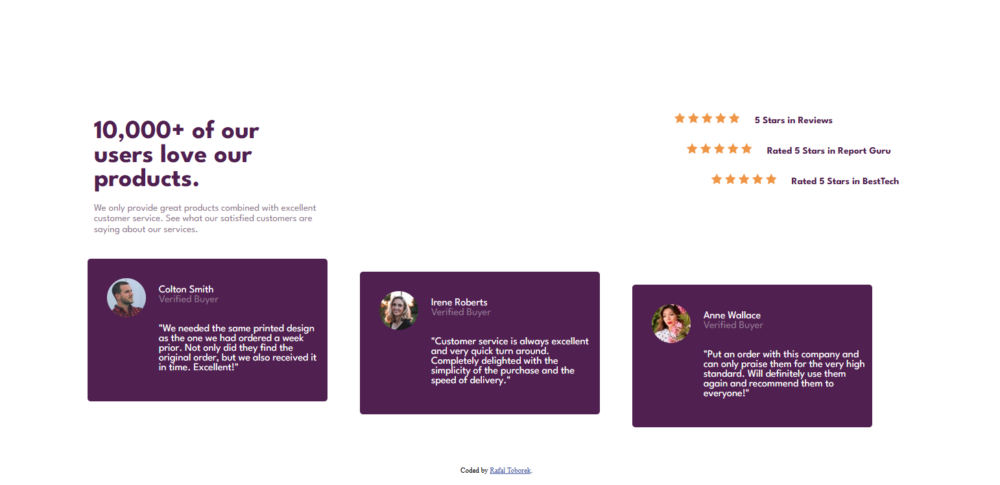

# CTI-110 Final Project - Social proof section solution


## Table of contents

- [CTI-110 Final Project - Social proof section solution](#cti-110-final-project---social-proof-section-solution)
  - [Table of contents](#table-of-contents)
  - [Overview](#overview)
    - [The challenge](#the-challenge)
    - [Screenshot](#screenshot)
    - [Links](#links)
  - [My process](#my-process)
    - [Built with](#built-with)
    - [What I learned](#what-i-learned)
    - [Continued development](#continued-development)
    - [Useful resources](#useful-resources)
  - [Author](#author)
  - [Acknowledgments](#acknowledgments)


## Overview

### The challenge

Users should be able to:

- View the optimal layout for the section depending on their device's screen size

### Screenshot



Add a screenshot of your solution. The easiest way to do this is to use Firefox or other browser to view your project, right-click the page and select "Take a Screenshot". You can choose either a full-height screenshot or a cropped one based on how long the page is. If it's very long, it might be best to crop it.

Then crop/optimize/edit your image however you like, add it to your project, and update the file path in the image above.


### Links

- Repository URL: [Github Repo](https://github.com/Rafal-Toborek/Toborek-CTI-110-Final-Project-SOCIAL-PROOF-SECTION-MASTER-.git)
- Live Site URL: [Actual site](https://rafal-toborek.github.io/Toborek-CTI-110-Final-Project-SOCIAL-PROOF-SECTION-MASTER-/)

## My process

- Attended class
- Worked on coding tasks
- Collaborated with classmates for help
- Used online resources to find solutions
  
### Built with

- Semantic HTML5 markup
- CSS custom properties
- Flexbox
- CSS Grid
- [League Spartan](https://fonts.google.com/specimen/League+Spartan) - For styles


### What I learned

I learned a lot more about the box model and aligning objects horizontally to eachother. I also learned how to work with wrapping and making the site mobile proof with percent margins.    


```html
    <div class="container">
         
          <div class="container1">
             <p> <br> <span class="namecolton"> Colton Smith </span><br>
            <span class="vb">Verified Buyer</span> <br> <br> <br>
            "We needed the same printed design as the one we had ordered a week prior.
            Not only did they find the original order, but we also received it in time.
            Excellent!" </p> 
          </div>
          <div class="container2">
             <p> <br> <span class="nameirene"> Irene Roberts </span><br>
            <span class="vb">Verified Buyer</span> <br> <br> <br>
            "Customer service is always excellent and very quick turn around. Completely
            delighted with the simplicity of the purchase and the speed of delivery." </p> 
          </div>
          <div class="container3">
             <p> <br> <span class="nameanne"> Anne Wallace </span><br>
            <span class="vb">Verified Buyer</span> <br> <br> <br>
            "Put an order with this company and can only praise them for the very high
            standard. Will definitely use them again and recommend them to everyone!"</p> 
          </div>
```
```css
display: flex;
flex-wrap: wrap; 

body { margin: 10%;}
```


If you want more help with writing markdown, we'd recommend checking out [The Markdown Guide](https://www.markdownguide.org/) to learn more.


### Continued development

I want to learn more about boxes and display settings in html. I was able to get a general understanding of horizontal alignments.

### Useful resources

- [W3schools](https://www.w3schools.com) - Helped me understand the box model and proper alignments.
- [StackOverflow](https://stackoverflow.com) - Also helped me understand the box model and proper alignments.


## Author

- Website - [Rafal Toborek](https://www.your-site.com)

**Note: Delete this note and add/remove/edit lines above based on what links you'd like to share.**

## Acknowledgments

Alex Frieders, Mithun, Elnatan, Darsh, and Mr.Gardner

